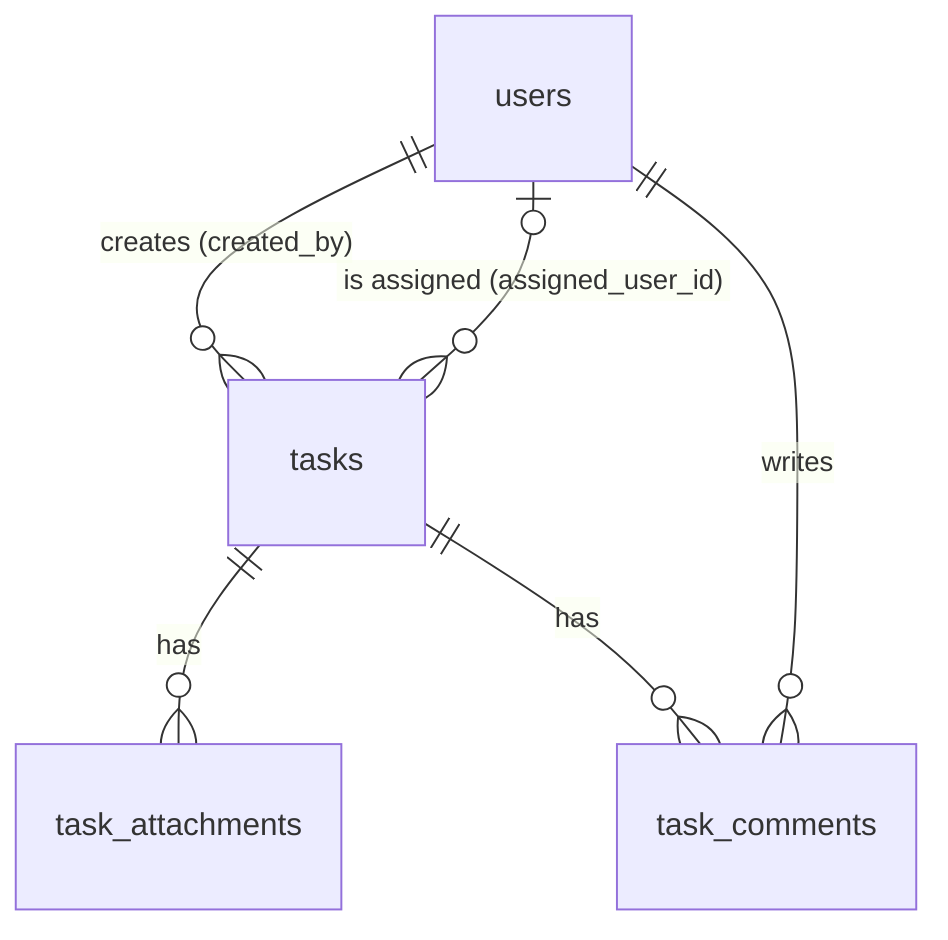

# Database Schema

MySQL 8, database `task_management`, `utf8mb4`. The source of truth is the Laravel migrations in `backend/database/migrations/`. A full dump (schema and seed data) is in `database/database.sql`.

## Entity relationships

## Tables

### `users`

| Column | Type | Notes |
|---|---|---|
| id | BIGINT UNSIGNED PK | |
| name | VARCHAR(255) | |
| email | VARCHAR(255) | **unique** |
| email_verified_at | TIMESTAMP NULL | Laravel default |
| password | VARCHAR(255) | bcrypt hash |
| role | ENUM('admin','member') | default `member`, **indexed** |
| remember_token | VARCHAR(100) NULL | Laravel default |
| created_at, updated_at | TIMESTAMP NULL | |

### `tasks`

| Column | Type | Notes |
|---|---|---|
| id | BIGINT UNSIGNED PK | |
| title | VARCHAR(255) | required |
| description | TEXT NULL | |
| status | ENUM('todo','in_progress','done') | default `todo`, **indexed** |
| priority | ENUM('low','medium','high') | default `medium`, **indexed** |
| assigned_user_id | BIGINT UNSIGNED NULL | FK → `users.id`, **ON DELETE SET NULL**, indexed |
| created_by | BIGINT UNSIGNED | FK → `users.id`, **ON DELETE CASCADE**, indexed |
| due_date | DATE NULL | **indexed** |
| created_at, updated_at | TIMESTAMP NULL | `created_at` **indexed** (default sort) |

### `task_attachments`

| Column | Type | Notes |
|---|---|---|
| id | BIGINT UNSIGNED PK | |
| task_id | BIGINT UNSIGNED | FK → `tasks.id`, **ON DELETE CASCADE**, indexed |
| file_name | VARCHAR(255) | original client filename (display and download name) |
| version | SMALLINT UNSIGNED | default `1`. Re-uploading the same `file_name` to the same task stores the next version. |
| file_path | VARCHAR(255) | random hashed path on the private disk, e.g. `attachments/3/Xk9…q.pdf` |
| thumbnail_path | VARCHAR(255) NULL | WebP preview, e.g. `thumbnails/3/Xk9…q.webp`. Set by the `GenerateThumbnail` job for clean images. |
| file_size | BIGINT UNSIGNED | bytes |
| mime_type | VARCHAR(127) | detected server-side from the file contents |
| scan_status | VARCHAR(16) | `pending` (default) → `clean` or `infected`, set by the `ScanAttachment` job. Downloads are allowed only when `clean`. |
| uploaded_at | TIMESTAMP | default `CURRENT_TIMESTAMP`. No `created_at`/`updated_at`: a new upload is a new version, not an update. |

Unique index `(task_id, file_name, version)` keeps version numbers unique per file and also covers the `task_id` FK.

### `task_comments`

| Column | Type | Notes |
|---|---|---|
| id | BIGINT UNSIGNED PK | |
| task_id | BIGINT UNSIGNED | FK → `tasks.id`, **ON DELETE CASCADE** |
| user_id | BIGINT UNSIGNED | FK → `users.id`, **ON DELETE CASCADE**, indexed |
| comment | TEXT | |
| created_at | TIMESTAMP | default `CURRENT_TIMESTAMP`. No `updated_at`: comments are not editable. |

Composite index `(task_id, created_at)` serves "comments of a task in chronological order" with a single index range scan. It also covers the `task_id` FK.

### Framework tables

`password_reset_tokens`, `sessions`, `cache`, `cache_locks`, `jobs`, `job_batches`, `failed_jobs` and `migrations` are Laravel defaults. `cache` holds the JWT logout blacklist, login rate-limit counters and chunked-upload sessions. `jobs` holds the queued attachment work (`ScanAttachment`, `GenerateThumbnail`), and `failed_jobs` keeps jobs that threw, for `php artisan queue:retry`.

## Foreign-key behaviour

| Relation | On delete | Reason |
|---|---|---|
| `tasks.created_by` → users | CASCADE | A task belongs to its creator. |
| `tasks.assigned_user_id` → users | SET NULL | Removing a user must not delete work. The task becomes unassigned. |
| `task_attachments.task_id` → tasks | CASCADE | DB rows go with the task. **Physical files and thumbnails** are removed by the `Task::deleting` model event. |
| `task_comments.task_id` → tasks | CASCADE | |
| `task_comments.user_id` → users | CASCADE | |

## Index rationale

| Index | Used by |
|---|---|
| `tasks.status`, `tasks.priority` | list filters `?status=`, `?priority=` |
| `tasks.assigned_user_id` | filter `?assigned_user_id=`, "my tasks", FK |
| `tasks.created_by` | policy checks, FK |
| `tasks.due_date`, `tasks.created_at` | sorting `?sort=due_date`, default `-created_at` |
| `users.role` | admin lookups |
| `users.email` (unique) | login |
| `task_comments (task_id, created_at)` | chronological comment list |
| `task_attachments (task_id, file_name, version)` (unique) | next version number on upload, "latest version per file" on the task detail |

Title search uses `LIKE '%term%'`, which cannot use a B-tree index. That is acceptable at this data size. For larger datasets, the next step would be a `FULLTEXT` index or a search engine such as Meilisearch or Laravel Scout.

## Seed data

`php artisan migrate --seed` (or importing the dump) loads the fixed dataset in `backend/database/seeders/data/demo.json`, so both give identical ids and content:

- 8 users: `admin@example.com` and `wisnu@transcosmos.com` (admin), `user@example.com`, `wisnu2@transcosmos.com` and 4 more members. All passwords are `password`.
- 29 tasks: 20 sample tasks with mixed status, priority, due dates and assignees (some unassigned), and 9 "Testing …" tasks (ids 33–41) that describe the manual QA scenarios for uploads, virus scan, chunked upload and versioning.
- 30 comments on the sample tasks.
- No attachments: their files live in `storage/app/private`, which is not part of the repository. Upload your own files to try the attachment features.
